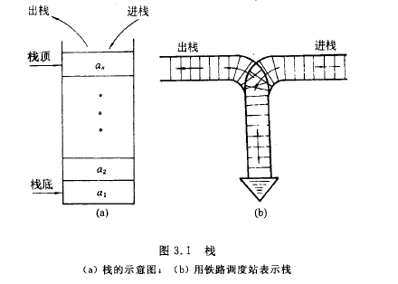
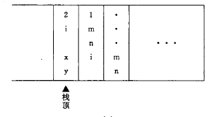
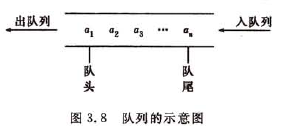

Table of Contents
=================

   * [3 栈和队列](#3-栈和队列)
      * [3.1 栈(stack)](#31-栈stack)
         * [3.1.1 栈的定义及特点](#311-栈的定义及特点)
         * [3.1.2 栈的表示和实现](#312-栈的表示和实现)
         * [3.1.3 栈与递归的实现](#313-栈与递归的实现)
      * [3.2 队列](#32-队列)
         * [3.2.1 队列的定义特点](#321-队列的定义特点)
         * [3.2.2 队列的实现](#322-队列的实现)
		
# 3 栈和队列

栈与队列都是线性表, 其特殊性在于湛河队列的操作是线性表的操作的子集, 他们是操作受限的线性表,

## 3.1 栈(stack)

### 3.1.1 栈的定义及特点

栈是限定仅仅在表尾巴进行插入(入栈)或删除(入栈)的线性表,即实行的是先入后出的策略(first-in, last-out, LIFO).其尾结点称之为栈顶(top), 头节点为栈底(bottom),不含元素的空表称为空栈.



### 3.1.2 栈的表示和实现

栈上的插入操作称为压入(push), 删除操作为弹出(pop).测试一个栈是否可用可以用查询操作STACK-EMPTY.若试图度一个空栈执行弹出操作, 则称栈下溢(underflow),即一个错误. 若栈顶超出容量, 则称为栈上溢(overflow).

与线性表一样有两种实现方式:

1. 基于数组实现

   使用一个数组S[1..n]来实现一个最多可容纳n个元素的栈.该数组有一个属性`S.top`, 指向最新插入的元素. 栈中包含的元素为`S[1..S.top]`, 其中`S[1]`是栈底元素而`S[S.top]`是栈顶元素.

   有如下几种操作

   ```c
   //判断栈是否为空
   STACK-EMPTY(S)
   	if S.top == 0
   		return true
   	else return false
   	
   //入栈
   PUSH(S,x)
   	if S.top == S.length
   		error "overflow"
   	S.top = S.top + 1
   	S[S.top] = x
   	
   //出栈
   POP(S)
   	if STACK-EMPTU(S)
   		error "underflow"
   	else S.top = S.top - 1
   		return S[S.top + 1]
   ```

2. 基于链表的实现

   基于链表实现的栈, 容量没有限制, 也更符合栈的特点,至少存在一个头节点S, 当`S.prev == nil`时为空栈

   ```c
   //结点抽象结构
   ADT Node
   	key
   	prev
   	
   //判断栈是否为空
   STACK-EMPTY(S)
   	if S.prev == prev
   		return true
   	else
   		return false
   	
   //入栈, key为x的结点压入栈
   PUSH(S,x)
   	creat a node N//创建一个结点储存x
   	N.key = x
   	N.prev = S.prev
   	S.prev = N
   	
   //出栈
   POP(S)
   	if STACK-EMPTU(S)
   		error "underflow"
   	else 
   		x = S.prev
   		S.prev = S.prev.prev
   		return x
   ```

3. 无论时那种实现, 三种操作的执行效率均为O(1)


### 3.1.3 栈与递归的实现

在程序设计语言中,一个之间或者间接的语句调用自己的函数, 称之为递归函数. 调用函数和被调用函数之间的链接信息交换需要通过栈来进行.

通常而言在某个函数运行时调用一个函数运行之前, 系统会有如下三个步骤:

1. 将所有的实在参数, 返回地址等信息传递给被调用函数保存
2. 为调用函数的局部变量分配存储区
3. 将控制转移到被掉函数的入口

在被调用函数返回之前, 系统也将完成三件事:

1. 保存被调函数的计算结果
2. 释放被调函数的数据区域
3. 依照被调函数保存的返回地址将控制转移到调用函数

而栈所在这个过程中实现函数间的信息传递和控制转移, 主函数压入栈中, 之后压入被调函数, 运行的函数总是在栈顶, 函数退出时就出栈返回上一个函数.简易关系如下三个函数:

```c
main()
	int m,n
	first(m,n)
	
first(m,n)
	int i
	second(i)
	
second(i)
	int x,y
```




## 3.2 队列

### 3.2.1 队列的定义特点

队列是实行先入先出(fist in fist out, FIFO)策略的线性表.删除操作叫出队, 插入操作叫入队, 允许插入的一端叫做队尾, 允许删除的一端称之为队头.



### 3.2.2 队列的实现

与栈类似, 队列有两种实现方式

1. 顺序实现

用数组Q[1..2]来实现一个最多容纳`n-1`个元素的队列的一种方式, 该队列有一个属性`Q.head`指向对头元素,属性`Q.tail`则指向下一个新元素将要插入的位置.当时图从空队列中执行出队时会发生下溢，再队列满的时候入队会发生上溢，一下时顺序队列的几个操作，下面的入队和出队的操作中，忽略了下溢和上溢的检查

```c
ENQUEUE(Q, x)
	Q[Q.tail] = x
	if Q.tail == Q.length
		Q.tail = 1
	else Q.tail += 1
	
DEQUEEU(Q, x)
	x = Q[Q.head]
	if Q.head = Q.length
		Q.head = 1
	else 
		Q.head += 1
	return x
```

上述两种操作的时间都为O（1）


2. 链式实现

   空队列也至少含有一个结点Q                                 

   ```c
   //结点抽象结构
   ADT Node
   	key
   	next
   	
   ADT Q
   	head
   	tail
   	
   ENQUEUE(Q, x)
   	creat node N
   	N.key = x
   	N.key = nil
   	Q.tail.next = N
   	Q.tail = N
   	
   DEQUEEU(Q, x)
   	if Q.head == nil
   		return nil
   	else 
   		x = Q.head
   		Q.head = x.next
   		return x.key
   ```

   以上两种操作执行时间也为O(1)