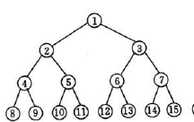
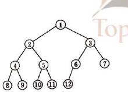
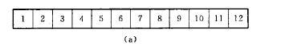
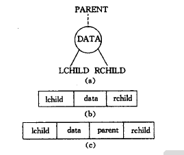
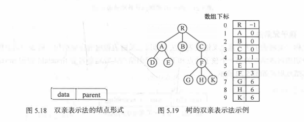
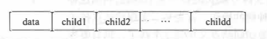
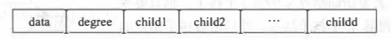
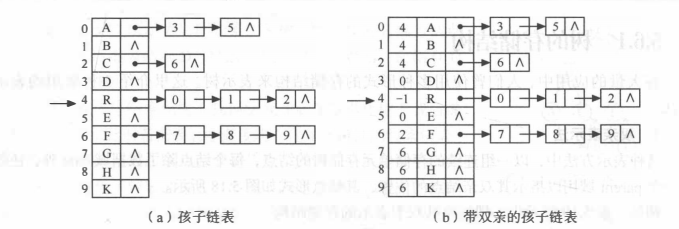
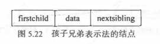
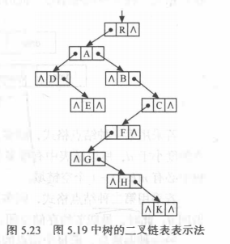

[toc]


#  4 树

树形结构是一类重要的非线性数据结构,其中以树和二叉树最为常用, 直观来看, 树是以分支关系自定义的层次结构.把它叫做“树”是因为它看起来像一棵倒挂的树，也就是说它是根朝上，而叶朝下的。

## 4.1 树与基本术语的定义

1. 树的定义: 树（tree）是包含n（n>=0）个结点的有穷集，其中

- 每个元素称为结点（node）

* 有一个特定的结点被称为根结点或树根（root）

  * 除根结点之外的其余数据元素被分为m（m≥0）个互不相交的集合T1，T2，……Tm-1，其中每一个集合`T_i（1<=i<=m）`本身也是一棵树，被称作原树的子树（subtree）

2. 树的基本术语

   - 空树:  没有结点的树
   - 度: 结点含有的子树的个数称之为该节点的度
   - 叶节点(终端结点): 度为零的结点
   - 分支结点(非终端结点): 度不为零的结点
   - 子节点: 结点的子树的根为子节点
   - 父节点: 子节点的根为该子节点的父节点
   - 兄弟结点:同一个根节点下的同一级结点.
   - 结点的层次: 根节点开始定义, 根为第一层, 根的子节点为第二层,以此类推
   - 子孙：以某结点为根的子树中任一结点都称为该结点的子孙
   - 树的高度(深度): 树中结点的最大层次称为树的深度
   - 森林：由m（m>=0）棵互不相交的树的集合称为森林
   - 有(无)序树: 将树中结点的各子数看成从左至右是有次序的(不能互换顺序),则称该树为有序树, 否则称为无序树


## 4.2 二叉树

### 1.定义和性质

1. 定义: 二叉树(Binary Tree)是最多含有两个子树的二叉树, 两个子树由左右之分, 次序不能颠倒是有序树.

2. 性质:

   * 根据二叉树定义, 表明二叉树可以为空, 或有一个根节点加上两个左右子树互不相交的二叉树组成.
   * 深度为`k`的树最多有`2^k-1`个结点
   * 在二叉树的第`i`层上最多有`2^(i-1)`个结点

3. 完全与满二叉树

   - 满二叉树: 深度为`k`且有`2^k-1`个结点的二叉树称为满二叉树,特点为每层的结点数都满了.

   

   - 完全二叉树:  深度为`k`的含有`n`个结点的二叉树, 当且精当每一个结点都与深度`k`的满而擦函数中编号从1至n一一对应时,为完全二叉树. 特点为不会超过一层中结点不满, 不满的分支里, 结点从左至右排布

     

### 2. 二叉树的存储结构与表达方法

树结构虽然是非线性的逻辑结构, 但是仍然有两种物理存储方式

1. 线性存储结构

   用一组地址连续的存储单元依次自上而下, 从左至右存储完全二叉树上的结点元素, 即将完全二叉树上编号为`i`的结点由如上定义下的一维数组中下标为`i-1`的分量中. 如将上面的完全二叉树顺序存储结构如图

   

   这种其中为零的单元表示没有该节点 , 故仅适用于完全二叉树. 在最坏的情况下一个深度为k且只有k个结点的单只树需要`2^k-1`个单元, 不灵活

2. 链式存储结构

   构造的结点结构不同可构成不同形式的链式存储结构. 

   例如:

   结点里可以包含左右指针, 保存的元素, 以及头节点的指针.

3. 左子右兄弟法:

   物理存储形式为链式存储, 每个结点中的左指针指向其最左边的子节点, 其右节点指向其右边相邻的兄弟结点

### 3. 二叉树的基本操作

1. 求度

2. 求深度和高度

3. 判断结点类型

4. 查找兄弟结点

   等


## 4.3 遍历二叉, 线索二叉树与重建二叉树

### 1.遍历二叉树

遍历二叉树的其实就是以一定规则将二叉树中的结点排列成一个线性序列，得到二叉树中结点的先序序列、中序序列或后序序列:

- 先序遍历(`Preorder Tree Walk`) :按照根节点, 左子树, 右子树的顺序访问节点.

  ```
  //递归版
  preTraverse(u)
  	if u == nill
  		return 
  	print u
  	preTraverse(T[u].left)
  	preTraverse(T[u].right)
  
  //迭代版
  preTraverse(u)
  	if u == nil
  		return
  	stack.Push(u)
  	for !stack.Empty()
  		top = stack.Pop()
  		print(top.val)
  		if top.right != nil
  			stack.Push(top.right)
  		if top.left != nil
  			stack.Push(top.left)
  		
  ```

- 中序遍历(`Inorder Tree Walk`): 按照左子树, 根节点, 右子树的顺序访问节点.

  ```
  //递归
  inTraverse(u)
  	if u == nill
  		return 
  	inTraverse(T[u].left) 
  	print u
  	inTraverse(T[u].right)
  
  //迭代
  inTraverse(u)
  	p = u
  	for p != nil || !stack.Empty()
  		if p != nil
  			stack.Push(p)
  			p = p.left
  		else
  			q = stack.Pop()
  			print(q.val)
  			p = q.right
  ```

  

- 后序遍历(`postorder Tree Walk`): 按照左子树, 右子树, 根节点的顺序访问树.

  ```
  postTraverse(u)
  	if u == nill
  		return 
  	postTraverse(T[u].left)
  	postTraverse(T[u].right)
  	print u
  	
  //非递归遍历 使用两个栈
  postTraverse(u)
  	if u == nil
  		return
  	stack s,r //两个栈,r用于保存结果
  	s.Push(u)
  	for cur != nil || !s.Empty()
  		cur = s.Pop
  		r.Push(cur)
  		if cur.left != nil
  			s.Push(cur.left)
  		if cur.right != nil
  			s.Push(cur.right)
  	for !r.Empty
  		print(r.pop)
  
  //use two stack
  postTraverse(u)
  	cur = u
  	node pre
  	stack s
  	for cur != nil || !s.Empty()
  		for cur != nil
  			s.Push(cur)
  			cur = cur.left
  		if !s.Empty()
  			cur = s.Top()
  			if cur.right == nil || cur.right == pre //condition of Stack pop
  				print(s.Pop())
  				pre = cur
  				cur = nil
  			else
  				cur = cur.right
  ```


   除了按照上述序列遍历， 还可以从上到下， 从左到右层次进行

- 层次遍历法

  ```
  levelTraverse(u)
      if u != nil
         queue.Enqueue(u)
      for (!queue.Empty())
         top = queue.Dequeue()
         if top.left != nil
            queue.Enqueue(top.left)
         if top.right != nil
            queue.Enqueue(top.right)
         print(top.val)
  ```


### 2. 线索二叉树(Threaded Binary Tree)

1. 定义

   在二叉树的结点上加上线索的二叉树称为线索二叉树，对二叉树以某种遍历方式（如先序、中序、后序或层次等）进行遍历，使其变为线索二叉树的过程称为对二叉树进行线索化.

2. 规则:

   若结点的左子树为空，则该结点的左孩子指针指向其前驱结点。
   若结点的右子树为空，则该结点的右孩子指针指向其后继结点。

3. 线索化二叉树:

   在遍历二叉树的过程中按照线索化的规则修改两个标志域与空的左右指针指向前驱后继即可.

### 3 .二叉树的重建


若将树按照前序与中序输出, 根据此按后序遍历树.

- 分析:首先按先序遍历的顺序访问各节点., 然后通过中序遍历得到树的左右子树.

- 算法描述:

  ```
  reconstruction(left, right) 
  	if left >= right 
  		return
  	//获取当前树的中间值
  	midValue := pre[next]
  	//获取中间值在中序遍历中的位置
  	m := index(in, midValue)
  	reconstruction(left, m)
  	reconstruction(m+1, right)
  	print(midValue)
  	
  ```

- 算法的对每层递归执行的复杂度为O(n), 最坏的情况下复杂度为O(n^2)


## 4.4 树和森林

### 1. 树的存储结构

有三种常用的树的存储结构表示树:

1. 双亲表示法

   每个结点除了数据域, 还有一个parent域指示父节点的位置

   

   优点在求结点的父节点遍历, 易求树的根节点, 但求子节点需要遍历整个结构

2. 孩子表示法

   树中每个结点可能有多个子节点,则可以在每个结点中设置多个指针域指向每棵树的根节点.

   每个结点同构时(结点的结构相同)结点结构如下,由于每个结点的度不相同, 会造成大量的指针域浪费.

   

   结点不同构时, 虽然节约了存储空间, 但是结点的度也就固定了,操作不便

   

   另外的办法是, 每个结点的子节点排列起来看出一个线性表使用单链表存储, 而树的n个头指针又组成一个线性表,如下图(a).

   

   而(b)则是在(a)的基础上加入了父节点的指针域

3. 左子右兄弟法

   又称二叉树表示法或二叉链表表示法. 结点中的两个链域分别指向该节点的第一个子节点和下一个兄弟结点.

   结构如图

   

   优点在于它和二叉树的二叉链表表示完全一样, 便于将一般的树结构转换为二叉树进行处理, 利用二叉树的算法来实现对树的操作.