[toc]

# 5 图

图结构中, 结点之间的关系可以是任意的, 途中任意两个数据元素之间都可能相关.


## 5.1 图的定义与基本术语

### 1. 图的定义

图(Graph)由两个集合V和E组成, 记为G=(V,E), V为顶点的非空有穷集, E是V中顶点偶对的有穷集合.

对于G, 若边集E(G)为有序集则G为有向图, 若E(G)为无序集则G为无向图.

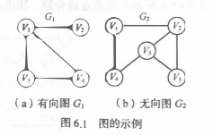


### 2. 图的基本术语

用n表示图的顶点数目, e表示边的数目.

- **子图**:  若有两个图G=(V,E)和G'=(V',E'), 若V'包含于V, E'包含于E. 则称G'为G的子图

- **无向完全图**与**有向完全图**: 对于图,每个顶点都与其他的顶点有关系, 若图为有向图则称为有向完全图.若为无向图则称为无向完全图

- **稀疏图**和**稠密图**: 有很少条边或弧的图称为稀疏图, 反之为稠密图

- **权**和**网**: 每条边上标有某种含义的数值, 该数值称为边上的权. 权可以表示一个顶点到另一个顶点的距离或耗费等含义, 这种带权图通常称为网.

- **邻接点**: 一个图中, 若两个结点由同一条边关联, 则这两个结点为零接结点

- **度**: 在图中, 某一个结点关联的边数称为该点的度

- **出度**:G为有向图, 射入结点v的边数

- **入度**:G为有向图, 射出结点的边数为其出度

- **欧拉定理**: 每个图中, 结点的度数等于边数的两倍

- 路径和路径长度: 图中两个两个顶点之间的路径上的顶点序列称为路径, 路径长度是一条路径上的边或弧的数目.

- 回路或环: 第一个顶点和最后一个顶点相同的路径称为回路或环

- 简单路径, 简单回路或简单环: 序列中顶点不重复出现的路径称为简单路径. 除了第一个和最后一个顶点外, 其余顶点不重复出现的回路称为简单回路或简单环.

- 连通, 连通图或联通分量: 两个顶点之间有路径,则称两个顶点是连通的. 若对于图中任意两个顶点都是联通的则称改图为连通图.无向图中的极大联通子图为连通分量.

  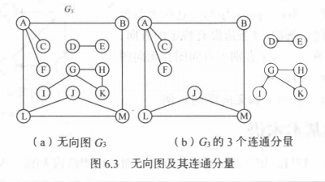

- 强连通图和强连通分量: 对于有向图中任意两个顶点, 都存在路径, 则称改图为强连通图.有向图中的极大强连通子图称为有向图的强连通分量

  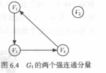

- 连通图的生成树: 一个极小连通子图, 这样的连通子图称为连通图的生成树. 

- 有向树和生成森林: 有一个顶点的入度为0, 其余顶点的入度均为1的有向图称为有向树. 一个有向图的生成森林是由若干棵有向树组成, 含有图中全部顶点, 但只有足以构成若干棵不相交的有向树的弧.

  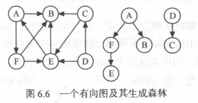

  图的分类思维注记图:
  
  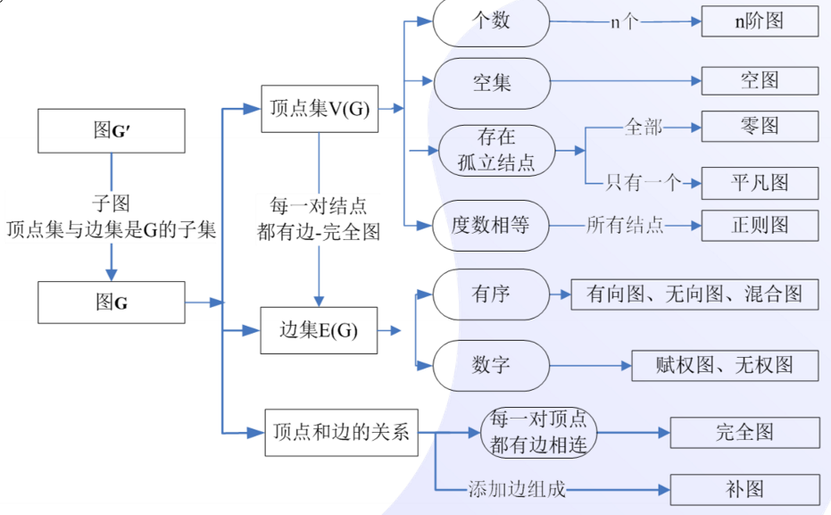
  
  


## 5.2 图的存储结构

可以借助二维数组来表示元素之间的关系, 即邻接矩阵表示法.另一方面两个顶点之间可能存在关系, 故也可以通过链式存储表示图. 图的链式存储有多中: 邻接表,. 十字链表和邻接多重表根据实际需要选择不同的存储结构.

### 5.2.1 邻接矩阵

#### 1.邻接矩阵表示法

​	邻接矩阵(Adjacency Matrix)是表示顶点之间相邻关系的矩阵.

​	设G(V, E)是n阶图, 则G的邻接矩阵是具有如下性质的n阶矩阵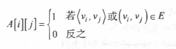

​	举例:

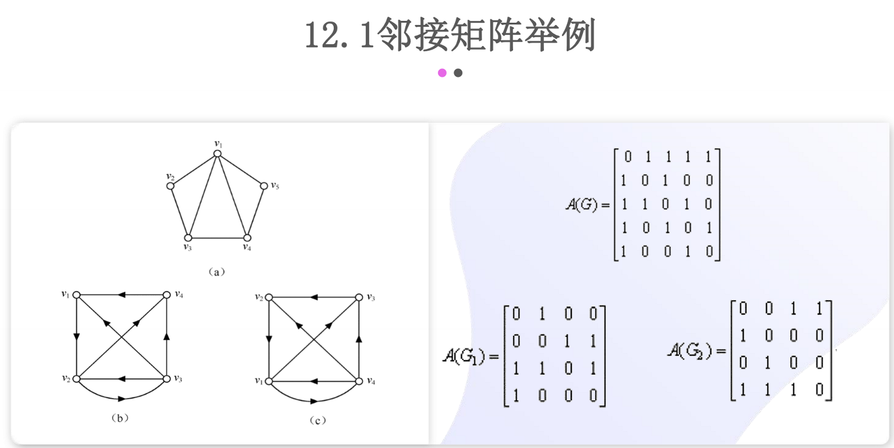


​	若G是网则邻接矩阵定义为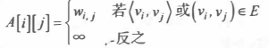

​	wi,j  表示边上的权值, 无穷表示计算机允许的大于所有边上权值的数.例如

​	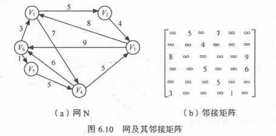

根据邻接矩阵表示法的特点可知道, 邻接矩阵内容的顺序是由结点的顺序来决定的, 故对n阶图, 共有n的阶层种邻接矩阵,  在程序中使用邻接矩阵时还要给出顶点的信息.

```
struct AMGrap
	vexs[] //顶点表
	arcs[][] //邻接矩阵
	vexnum,arcnum	
```

#### 2.邻接矩阵法创建无向网

算法描述:

1. 输入总顶点数和总边数
2. 依次输入点的信息存入顶点表中
3. 初始化邻接矩阵, 使每个权值初始化为极大值
4. 构造邻接矩阵.依次输入每条边依附的顶点和权值, 确定两个点在图中的位置之后, 使相应边赋予相应的权值, 同时对其对称边赋予相同的权值

算法分析: 该算法的时间复杂度为O(n^2)

```
CreateUDN(AMGrap &G)
	input G.vexnum, G.arcnum
	for i form 0 to G.vexnum
		input G.vexs[i]
	for i form 0 to G.vexnum
        for j from 0 to G.vexnum
        	G.arcs[i][j] = MAXINT
	for k form 0 to G.arcnum
		input v1,v2,w
		i = LocateVex(G,v1)
		j = LocateVex(G,v2)
		G.arcs[i][j] = w
		G.arcs[j][i] = w
```

若要建立无向图, 只需要对上面的算法做出两点改动: 

1. 初始化邻接矩阵时, 将边的权值均初始化为0
2. 构造邻接矩阵时, 权值的常量为1

```
CreateUDG(AMGrap &G)
	input G.vexnum, G.arcnum
	for i form 0 to G.vexnum
		input G.vexs[i]
	for i form 0 to G.vexnum
        for j from 0 to G.vexnum
        	G.arcs[i][j] = 0
	for i form 0 to G.arcnum
		input v1,v2
		i = LocateVex(G,v1)
		j = LocateVex(G,v2)
		G.arcs[i][j] = 1
		G.arcs[j][i] = 1
```


#### 3. 邻接矩阵法的优缺点

- 优点

  1. 便于判断两个顶点的关系
  2. 便于计算顶点的度.  对无向图, 邻接矩阵的第i行元素之和就是顶点i的度; 对于有向图, 第i行元素之和就是顶点i的出度, 第i列元素之和就是顶点i的入度

- 缺点
  1. 存储时, 矩阵大小固定了  不便于执行增加与删除操作.
  2. 不便于统计边的数目, 需要扫描整个矩阵才能知道.
  3. 空间复杂度高. 当边的关系少而顶点数目多时, 空间利用率低.

  
  
### 5.2.2 邻接表

####   1. 邻接表表示法

**邻接表(Adjacency List)**是图的链式存储结构.邻接表中, 对图中每个顶点vi建立一个单链表, 再把与vi相邻接的顶点放在此链表中. 邻接表表中的每个单链表的第一个结点存放有关顶点的信息, 把这一结点看成链表的表头, 其余结点存放边的信息. 即有两部分组成:**表头节点表**和**边表**

- 表头节点表: 包括数据域和链域

- 边表: 包括邻接点域, 数据域和链域三部分

  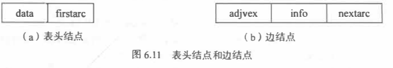

存储结构说明

```
struct ArcNode	//边结点
	int adjvex
	ArcNode* nextarc
	info
strcut VNode	//顶点
	data
	ArcNode* firstarc
struct ALGraph
	int vexnum, arcnum
	VNode[] vertices	//顶点集
```

#### 2. 邻接表表示法创建无向图

算法步骤:

1. 输入顶点数和边数
2. 依次输入点的信息存入顶点表中, 是每个表头结点得指针域初始化为空
3. 创建邻接表, 依次输入每条边依附得两个顶点, 确定两个顶点的数组下标i,j之后,将边结点分别插入vi和vj对应的两个边链表的头部

算法描述:

```
CreateUDG(ALGraph &G)
	input G.vexnum, G.arcnum
	for i form 0 to G.vexnum
		input G.vertices[i].data
		G.vertices[i].firstarc = null
	for i from 0 to G.arcnum
		input v1,v2
		//获取两顶点的数组下标
		i = LocateVex(G,v1)
		j = LocateVex(G,v2)
		//创建vi的邻接结点
		p1 = new ArcNode
		p1.adjvex = j
		p1.nextarc = G.vertices[i].firstarc
		G.vertices[i].firstarc = p1
		//创建vj的邻接结点
		p2 = new ArcNode
		p2.adjvex = i
		p2.nextarc = G.vertices[j].firstarc
		G.vertices[j].firstarc = p2
```

算法分析:

算法时间复杂度胃为O(n+e)


#### 3.邻接表表示法的优缺点

- 优点
  1. 便于增删操作
  2. 便于统计边的数目, 按顶点表顺序扫描所有边表即可得,时间复杂度为O(n+e)
  3. 空间效率高
- 缺点
  1. 不便于直接判断两顶点之间是否有边
  2. 不便于计算有向图各个顶点的度. 对无向图, 在邻接表表示法中顶点vi的度是第i个边表中的结点个数. 而在有向图邻接表中, 第i个边表上的节点个数是顶点vi的出度, 但求vi的入度比较困难, 需要遍历哥哥顶迪安的边表. 而若使用逆邻接表表示则相反, 求出度比较困难

### 5.2.3 十字链表

**十字链表(Orthogonal List)**是有向图的令一种链式存储结构.

十字链表中对饮有向图中的每一条弧有一个结点, 对应的每个顶点也有一个结点结构如下

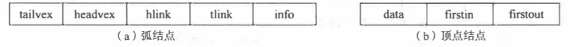

- 弧结点:
  - 尾域(tailvex)和头域(headvex)分别只是弧尾和弧头两顶点在图中的位置
  - hlink指向弧头相同的下一条弧
  - tlink指向弧尾相同的下一条弧
  - info为该弧的相关信息
- 顶点结点
  - data为数据域
  - firstin和first out为两个链域, 分别指向该顶点的弧头或弧尾的第一个弧结点

 存储结构说明

```
struct ArcBox
	int tailvex,headvex
	ArcBox* hlink,tlink
	info
struct VexNode
	data
	ArcBox* fistin,fistout
struct OLGraph
	VexNode[] xlist
	int vexnum, arcnum
```


### 5.2.4 邻接多重表

**邻接多重表(Adjacency Multilist)**是无向图的另一种链式存储形式.在进行某些图的引用问题中选哟对边进行某种操作, 如对已被搜索过的边做记号或删除一条边等, 此时需要表示同意条边的两个结点, 此时常用到邻接多重表存储图.

邻接多重表中每条边用一个结点表示


mark为标志域, 可以标记该条边是否被搜索过,ivex和jvex为该边依附的两个顶点在图中的位置,ilink指向下一条依附于顶点ivex的边, jlink指向下一条依附jvex的边. info存储边的信息

每个顶点也用一个结点表示, firstedge指示第一条依附于该顶点的边

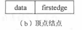

存储结构说明

```
struct EBox
	mark
	int ivex, jvex
	EBox* ilink,jlink
	info
struct VexBox
	data
	EBOx* firstedge
struct AMLGraph
	VexBox[] adjmutlist
	int vexnum, edgenum
```


## 5.3 图的遍历

根据搜索路径方向, 通常有两条遍历图的路径: **深度优先搜索**和**广度优先搜索**.

### 5.3.1 深度优先搜索

**深度优先搜索(Depth First Search, DFS)**是树的 先序遍历的推广.

#### 1.算法过程

对于一个连通图, 算法过程如下:

1. 从图中某个顶点出发
2. 找出刚访问过的顶点的第一个未被访问的邻接点, 访问该顶点. 以该顶点为新顶点, 重复此步骤, 直至访问过的顶点没有未被访问的邻接点为止
3. 返回前一个顶点, 寻找此时顶点还未访问过的顶点并访问该顶点
4. 重复2,3 直至图中所有的顶点都没有被访问过, 搜索结束.

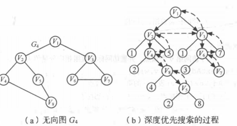

#### 2. 算法实现

在遍历过程中需要设置访问标志来记录访问过的结点

##### 深度优先搜索遍历连通图

步骤描述

1. 图中某个顶点v出发, 访问v, 设置visited[v]为true
2. 依次检查v的所有邻接点w, 若visited[w]为false, 再从w出发进行遍历递归, 直至所有顶点访问完毕

算法描述

```
bool[] visited
void DFS(Graph G, int v)
	output v	//输出开始访问的结点
	visited[v] = true
	//依次访问v的每个邻接点
	for w=FistAdjVex(G,v); w>=0; w = NextAdjVex(G,v,w)
		if !visited(W)
			DFS(G,w)
```

##### 深度优先搜索遍历非连通图

对于非连通图, 上述算法执行之后还有一些顶点没有被访问, 需从图中另选顶点作为起始点.

算法描述

```
DFSTraverse(Graph G)
	intialize visited
	for v form 0 to G.vexnum
		if !visited(v)
			DFS(G,v)
```

#####  邻接表表示图的深度优先搜索遍历

```
DFS_AM(AMGraph G,int v)
	output v
	visited[v] = true
	p = G.vertices[v].firstarc
	while p != null
		w = p.adjvex
		if !visited[wj]
			DFS_AM(G,v)
		p = p.nextarc
```

#### 3. 算法分析

遍历的过程实际上是对每个顶点查找邻接点的过程, 耗费时间取决于所采用的图的存储形式.

使用邻接矩阵时, 查找邻接点的复杂度为O(n^2), n为顶点数.

使用邻接表时, 查找邻接点的时间复杂度为O(e).e为图中的边数, 故此时深度优先搜索的时间复杂度为O(n+e)


### 5.3.2 广度优先搜索

**广度优先搜索(Breadth First Search, BFS)**类似树的层次遍历过程

#### 1. 算法过程

1. 从图中某个顶点v出发, 访问v
2. 依次访问v的各个未访问过的邻接点
3. 分别从这些邻接点出发依次访问他们的邻接点, 并使先被访问的顶点的邻接点先于后被访问的邻接点被访问, 重复步骤3,直至所有顶点被访问到

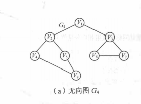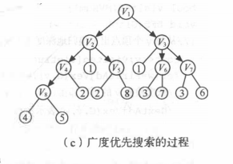

#### 2. 算法实现

先被访问的顶点及其邻接点先被访问, 为此算法实现需要引入队列保存已被访问过的顶点, 以及一个标志数组记录放过过的结点.

##### 广度优先搜索遍历连通图

算法步骤

1. 从图中某个顶点v出发, 访问v, 并设置visited[v]为true, 将v进队列
2. 只要队不为空重复以下操作:
   - 队头顶点u出队
   - 依次检查u的所有邻接点w, 如果visited[w]为false,则访问w, 并设置visited[v]为true, 然后入队w

算法描述

```
BFS(Graph G, int v)
	output v
	visited[v] = true
	Q.Init()
	Q.Enqueue(v)
	while !Q.Empty()
		u = Q.Dequeue()
		for w=FirstvAdjVex(G,u); w>=0; w=NextAdjVex(G,u,w)
			if !visited(w)
				output w
				visited[w]=true
				Q.Enqueue(w)
```

对于非连通图, 则需要从图中令选一个未被访问的顶点作为起始点,重复BFS过程即可.


#### 3.算法分析

每个顶点至多进一次队列. 遍历图的过程实际上是通过边找邻接点的过程, 因此广度优先和深度优先时间复杂度相同.区别仅仅在于对顶点访问顺序不同.


## 5.4 图的应用

### 5.4.1 最小生成树

对于n个顶点的带权连通图，可以建立不同的生成树， 每一颗生成树都是该树的子图， 在所有的连通子图中， 权和最小的子图叫该图的**最小生成树**， 也称为**最小代价生成树(Minimum Cost Spanning Tree)**或**最小权重生成树**。求该生成树的问题称为**最小生成树问题**

主要讨论两种求最小生成树的算法：Prim算法和Kruskal算法。

两种算法都是贪心算法， 贪心算法每一步必须在多个可能的选择中选择一种。 贪心算法推荐选择当前最优解，但不能保证全局最优解。 但对于最小生成树问题而言， 贪心策略能找到权重最小的生成树。

#### 1. 最小生成树的形成

对于一个连通无向图`G=(V, E)`和权重系数`w: E->R`, 求解最小生成树的通用贪心策略为：

> 在每个时刻生长出最小生成树的一条边， 并在整个策略的实施过程中， 对于边集合A：在每次迭代前， A是某棵最小生成树的一个子集


算法描述

每一步之前, 选择一条边(u, v)加入到集合A中, 满足`A+{(u,v)}`也是某棵最小生成树的子集，称这样的边为集合A的**安全边**

```
GENERIC-MST(G, w)
	A = nil
	While A does not from a spanning tree
		find an edge(u, v) that is safe for A
		A = A + (u,v)
	return A
```

#### 2. Prim 算法

##### 构造过程：

无向连通图`G=(V, E)`和权重系数`w: E->R`，A是最小生成树边集

1. U={u0}(u0属于V)
2. 在U中找一点u0，V-U中找一点v0，满足(u0,v0)权值最小，加入集合A， v0加入U
3. 重复步骤二， 直到U=V为止

prim算法逐步增加U中的顶点, 可称为**加点法**

**算法实现：**

无向网G以邻接矩阵存储， 顶点u出发构造G的最小生成树T，并输出T的各条边 

需要设置辅助数组closedge, 记录U到V-U的最小权值边。closedge[i-1].lowcost=Min{cost(ui,vi)|u含于U}， cost(ui, vi)表示(u, v)的权重

```
//closedge的基本单位
Element
	adjvex //最小边在U中的顶点
	lowcost	// 最小边上的权值
```

**算法描述**

算法步骤：

1. 将初始顶点u加入U中， 对其余的每一个顶点vj， 将closedge[j]初始化到u的边信息
2. 迭代n-1次， 执行下列步骤：
   - 从各组边中选出最小边closedge[k], 输出此边
   - k加入U中更新每组最小边信息closedge[j], 对于V-U中的边， 新增加了一条k到j的边， 若新边的权值小于closedge[j].lowcost，更新新边的权值。

```c
Prim(G,u)
	K = LocateVex(G,u)
    for j=0 to G.vexnum
    	if j != k
    		closedge[j] = {v,G.arcks[k][j]}
    closedge[k].lowcost = 0
	for i=1 to G.vexnum
		k = Min(closedge)
		u0 = closedge[k].adjvex
		v0=G.vex[k]
		print u0, v0
		closedge[k].lowcost = 0
		for j=0 to G.vexnum
			if G.arcks[k][j] < close[j].lowcost
				closedge[j]={G.vex[k],G.arcs[k][j]}
```

**算法分析**

设网中有n个顶点， 第一个初始化的语句频度为n， 第二个循环频度为n-1， 内循环频度为n-1

故该算法时间复杂度为O(N^2),与边数无关.

#### 3.Krusal算法

Kruskal算法中, 集合A是一个森林, 其节点就是给定的图的节点, 每次加入到集合A中的安全边永远是权重最小的连接两个不同分量的边.

此算法中找到安全边的办法是: 在所有连接森林中两颗不同的树的边里面找到权重最小的边

**构造过程:**

假设连通网N=(V,E), 将N中的E按小到大权值排序

1. 初始状态有n个结点没有连接的森林T=(V,{}),图中每个顶点自成一个连通分量.
2. 在E中选择权值最小的边, 若边依附的顶点落在T中不同的连通分量上, 则加入到T中, 否则舍掉选择下一条
3. 重复步骤二, 直到T中所有的顶点都在同意连通分量上为止.

**算法实现**

算法实现需要引入以下辅助结构

1. 结构体数组Edge: 存储边得信息, 包括两个顶点和权值

   ```
   Edge []element
   
   element
   	head
   	tail
   	lowcost
   ```

2. vexset[i]:标识各个顶点所属的连通分量. 对于每个含于V中的vi,在辅助数组中存在一个相应元素vexset[i]表示该顶点所在的连通分量,初始时vexset[i] = i, 表示各个顶点自成一个连通分量

**算法步骤**

1. 将数组Edge中的元素按照权重从小到大排序
2. 依次查看数组Edge中的边, 循环执行以下操作:
   - 依次从排好序的数组Edge中存储一条边(U1, U2)
   - vexset中分别查找v1和v2所在的连通分量vs1和vs2, 进行判断:
     - vs1 != vs2, 两顶点分属不同的连通分量, 输出此边, 合并vs1和vs2
     - vs1 ==  vs2, 两顶点属于同一个连通分量， 社区此边而选择下一条权值最小的边

**算法描述**

```c
Kruskal(G)
	sort Edge with increasing order by weight
	Make vexset
	for i=0 to G.arcnum
		v1,v2 = locatevex of Edge[i].head, Edge[i].tail from G
		vs1, vs2 = Vexset[v1], Vexset[v2]
		if(vsl != vs2)
			output head and tail
			for j = 0 to G.vexnum
				if vexset[j] == vs2
					Vexset[j] = vs1
```

**算法分析**

​	此算法依赖Edge的排序， 若使用堆排序，排序时间为O(elog_2e). 在循环中最好是的操作是合并两个不同的连通分量， 只要采取合适的数据结构， 可以证明其执行时间为O(log_2e),整个算法的时间复杂度为O(elog_2e),与边数有关，所以更适合求稀疏网的最小生成树

### 5.4.2 最短路径

带权有向网中, 第一个顶点为源点(Source), 最后一个顶点为终点(destination)

#### 1.单源最小路径问题

给定带权有向图G和源点v0, 求从v0到G中其余个顶点的最短路径.

按路径长度递增的次序产生的最短路径算法称为Dijkstra算法

##### (1) Dijkstra算法求解过程

对于网N=(V,E),将N中的顶点分为两组: 

- S : 已求出的最短路径的重点集合(初始时只包括v0)
- V-S : 尚未求出的最短路径顶点集合(初始时为V-{v0})

算法按各个顶点与v0之间最短路径长度递增的次序, 逐个将集合V-S中的顶点加入到集合S中去, 在这个过程中, 总保持v0到集合S中的个顶点的路径长度始终不大于集合V-S中个顶点的路径长度


##### (2) Dijkstra 算法的实现

假设用带权的邻接矩阵arcs来表示带权有向网G, `G.arcs[i][j]` 表示弧<vi,vj>上的权值. 若<vi,vj>不存在, 则让`G.arcs[i][j]`为INF, 源点为v0

需要以下辅助的数据结构

1. S[i] : 记录从源点v0到终点vi是否已被确定最短路径, true表示确定
2. Path[i] : 记录源点到终点的当前最短路径上vi的直接前驱顶点序号. 初值为: 若v0到vi有弧, 则Path[i] = v0, 否则-1
3.  D[i] : 记录源点到终点的当前最短路径长度, 初值为: 若v0到vi有弧, 则D[i]为弧上的权值 否则为INF


求得顶点vk的最短路径后, 将其加入到第一组顶点S中, 每当加入一个新的顶点到顶点集S, 对于第二组剩下的各个顶点而言, 多了一个中转的路径, 所以要对第二组剩余的各个顶点惊醒最短路径长度的更新.

原来v0到vi的最短路径长度为D[i], 加入vk之后, 以vk作为中转顶点的中转路径长度为:`D[K] + G.arcs[k][i]`, 若`D[K] + G.arcs[k][i] < D[i]`, 则用`D[K] + G.arcs[k][i]`代替D[i]

更新之后, 在选择数组D中值最小的顶点加入得到第一组顶点集S中, 如此进行下去, 知道图中所有顶点都加入第一组顶点集合S中为止.

**算法步骤**

1. 初始化

   - 将源点v0加入到S中, 即S[v0] = true
   - 将v0到各个顶点的最短路径长度初始化为权值, 即`D[i] = G.arcs[k][i]`
   - 若v0和顶点vi之间有弧, 将前驱置为v0, 即Path[i]=v0, 否则Path[i] = -1

2. 循环n-1次

   - 选择一条最短路径的终点vk使得: D[k] = Min{D[i]|vi 含于V-S}
   - vk加入S中, S[vk] = true
   - 更新最短路径长度和前驱数组

**算法描述**

```
Dijkstra(G, V0)
	//初始化
	for v = 0 to G.vexnum
		S[v] = false
		D[v] = G.arcs[v0][v]
		if	D[v] < INF
			Path[v] = v0
		else
			Path[v] = -1
	S[v0] = true
	D[v0] = 0
	for i = 1 to G.vexnum
		min = INF
		for w = 0 to G.vexnum
			if !S[w]&&D[w] < min
				v = w
				min = D[w]
		S[v] = true
		for w=0 to G.vexnum
			if !S[w] &&  (D[v]+G.arcs[v][w]<D[w])
				D[w] = D[v]+G.arcs[v][w]
				Path[w] = v
```


#### 2.每队顶点之间的最短路径

求解每一对顶点之间的最短路径有两种方法:其一是对图中每个顶点为源点共调用n次迪杰斯特拉算法, 其二是采用FLoyd算法. 算法时间复杂度均为O(n^3), 后者形式上比较简单


FLoyd算法任然使用带权的邻接矩阵arcs来表示有向网G, 求从顶点vi到vj的最短路径

需要以下辅助结构:

1. Path[i] : 最短路径上顶点vj的前一顶点的序号
2. 二维数组`D[i][j]` : 记录顶点vi和vj之间的最短路径长度


**Floyd算法步骤**

```
FLoyd(G)
	//初始化各对结点之间的路径和距离
	for i=0 to G.vexnum
		for j=0 to G.vexnum
			D[i][j] = G.arcs[i][j]
				if D[i][j] < INF	//若vi, vj之间有弧, j的前驱为i
					Path[i][j] = i
				else				//无弧, 前驱为-1
					Path[i][j] = -1
	for k=0 to G.vexnum
		for i=0 to G.vexnum
			for j=0 to G.vexnum
				if D[i][k]
```


### 5.4.3 拓扑排序

无环的有向图称作**有向无环图(Directed Acycline Graph)**,简称DAG图.