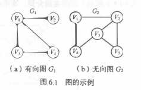
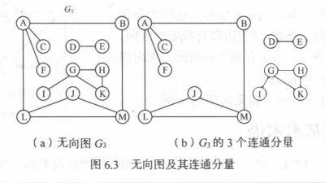
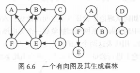

[toc]

# 5 图

图结构中, 结点之间的关系可以是任意的, 途中任意两个数据元素之间都可能相关.

## 5.1 图的定义与基本术语

### 1. 图的定义

图(Graph)由两个集合V和E组成, 记为G=(V,E), V为顶点的非空有穷集, E是V中顶点偶对的有穷集合.

对于G, 若边集E(G)为有序集则G为有向图, 若E(G)为无序集则G为无向图.

### 2. 图的基本术语

用n表示图的顶点数目, e表示边的数目.

- 子图:  若有两个图G=(V,E)和G'=(V',E'), 若V'包含于V, E'包含于E. 则称G'为G的子图

- 无向完全图与有向完全图: 对于图,每个顶点都与其他的顶点有关系, 若图为有向图则称为有向完全图.若为无向图则称为无向完全图

- 稀疏图和稠密图: 有很少条边或弧的图称为稀疏图, 反之为稠密图

- 权和网: 每条边上标有某种含义的数值, 该数值称为边上的权. 权可以表示一个顶点到另一个顶点的距离或耗费等含义, 这种带权图通常称为网.

- 邻接点: 一个图中, 若两个结点由同一条边关联, 则这两个结点为零接结点

- 度: 在图中, 某一个结点关联的边数称为该点的度

- 出度:G为有向图, 射入结点v的边数

- 入度:G为有向图, 射出结点的边数为其出度

- 欧拉定理: 每个图中, 结点的度数等于边数的两倍

- 路径和路径长度: 图中两个两个顶点之间的路径上的顶点序列称为路径, 路径长度是一条路径上的边或弧的数目.

- 回路或环: 第一个顶点和最后一个顶点相同的路径称为回路或环

- 简单路径, 简单回路或简单环: 序列中顶点不重复出现的路径称为简单路径. 除了第一个和最后一个顶点外, 其余顶点不重复出现的回路称为简单回路或简单环.

- 连通, 连通图或联通分量: 两个顶点之间有路径,则称两个顶点是连通的. 若对于图中任意两个顶点都是联通的则称改图为连通图.无向图中的极大联通子图为连通分量.

  

- 强连通图和强连通分量: 对于有向图中任意两个顶点, 都存在路径, 则称改图为强连通图.有向图中的极大强连通子图称为有向图的强连通分量

  

- 连通图的生成树: 一个极小连通子图, 这样的连通子图称为连通图的生成树. 

- 有向树和生成森林: 有一个顶点的入度为0, 其余顶点的入度均为1的有向图称为有向树. 一个有向图的生成森林是由若干棵有向树组成, 含有图中全部顶点, 但只有足以构成若干棵不相交的有向树的弧.

  

  