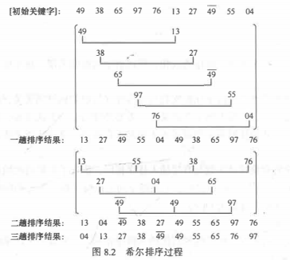

Table of Contents
=================

   * [Table of Contents](#table-of-contents)
   * [7 排序](#7-排序)
      * [7.1 基本概念与方法](#71-基本概念与方法)
         * [7.1.1 基本概念](#711-基本概念)
         * [7.1.2 内部排序分类](#712-内部排序分类)
         * [7.1.3 待排序记录的存储方式](#713-待排序记录的存储方式)
      * [7.2 插入排序](#72-插入排序)
         * [7.2.1 直接插入排序](#721-直接插入排序)
         * [7.2.2 折半插入排序](#722-折半插入排序)
      * [7.2.3 希尔排序](#723-希尔排序)
      * [7.3 交换排序](#73-交换排序)
         * [7.3.1 冒泡排序](#731-冒泡排序)
         * [7.3.2 快速排序](#732-快速排序)
      * [7.4 选择排序](#74-选择排序)
         * [7.4.1 简单选择排序](#741-简单选择排序)
         * [7.4.2 堆排序](#742-堆排序)
            * [1.堆](#1堆)
            * [2.维护堆的性质](#2维护堆的性质)
            * [3.建堆](#3建堆)
            * [4.堆排序](#4堆排序)
      * [7.5 归并排序](#75-归并排序)
      * [7.6 基数排序](#76-基数排序)
# 7 排序

## 7.1 基本概念与方法

### 7.1.1 基本概念

1.排序

**排序**是按关键字的非减或非递增顺序对一组记录重新进行排列的操作

2.排序稳定性

* 稳定排序: 在排序处理之后,两个相同的元素先后位置不会发生改变称为稳定排序.
* 不稳定排序: 排序处理之后, 两个相同的元素先后位置可能会发生改变.

3.内部排序与外部排序

- 内部排序: 待排序的元素存放在计算机内存中的进行排序的过程
- 外部排序: 待排序的元素数量大, 内存一次不能全部容纳, 排序过程中对外村进行访问的排序过程.

### 7.1.2 内部排序分类

排序过程中可以将排序记录区分为两个区域:有序序列区域和无序序列.

将有序区域中记录的数目增加一个或几个的操作称为一趟排序.

根据逐步扩大记录有序序列长度的原则不同可以将内部排序分为下面几类:

1. 插入类: 将无序子序列中的一个或多个记录插入到有序序列中. 主要包括**直接插入排序**, **折半插入排序**, **希尔排序**
2. 交换类: 通过交换无序序列中的元素而得到其中的最小或最大的关键字,并加入到有序子序列中, 依次方法增加记录的有序子序列的长度. 主要包括**冒泡排序**, 和**快速排序**
3. 选择类: 从记录的无序子序列中选择关键字最小或最大的元素, 加入到有序序列中, 以此方法增加记录的有序子序列的长度. 主要包括**简单选择排序**, **树形选择排序**和**堆排序**
4. 归并类: 通过合并两个或以上的有序序列. **二路归并排序**是最为常见的归并排序法
5. 分配类:唯一一类不需要关键字比较操作的排序方法, 排序利用分配和收集两种操作来完成. **基数排序**是主要的分配类排序方法

### 7.1.3 待排序记录的存储方式

1. 顺序表: 元素间分次序由存储位置决定, 实现排序需要移动记录
2. 链表: 记录之间的次序关系由指针实现, 排序不需要移动记录, 修改指针即可.
3. 地址排序: 元素存储再连续的地址单元中, 排序时不移动元素, 仅仅记录元素间的地址, 排序结束之后再按照地址向量中的值调整记录的存储位置.

## 7.2 插入排序

### 7.2.1 直接插入排序

**直接插入排序，Straight Insertion Sort**：基本操作为将一个元素插入到排好序的序列中，从而得到一个新的，增量记录为1的有序表。

* 算法描述:

  ```
  //待排序序列A
  InsertionSort(A)
      for i from 1 to A.length
          val = A[i]
          j = i
          while j > 0 and A[j-1] > val
              A[j] = A[j-1]
              j--
          A[j] = val 
  ```

* 复杂度分析:

  每个i循环需要执行i次,总共需要 $1+2+..+N-1=(N^2-N)/2$次.
  
  忽略常数项1/2, 又由于N与$N^2$相比可以小到足以忽略, 得出复杂度与$N^2$成正比.
  
  算法复杂度为$O(N^2)$.


* 算法适用性分析:

  * 在此算法中只将比`val`大的值向后平移, 不相邻的元素不会交换位置.因此整个算法十分稳定.
  * 插入算法的优势在于能很快处理相对有序的数据.

### 7.2.2 折半插入排序

**折半插入排序, Binary Insertion Sort**在查找操作中使用折半查找来将元素插入到排序好的序列中.

- 算法描述

  ```
  BinaryInsertionSort(A)
  	for i from 1 to A.length
          val = A[i]
          low = 0
          high = i
          while low < high
          	mid = (low+high)/2
          	if val < A[mid]
          		high = mid
          	else
        			low = mid+1
          for j from i downto high+1
          	A[j] = A[j-1]
          A[high] = val
  ```
  
  

- 复杂度分析

  时间复杂度上比较， 折半查找比顺序查找快， 所以就平均性能来说，折半插入排序优于直接插入排序。

  折半插入排序的移动次数与直接插入相同，仅减少了关键字间的比较次数，而记录的移动次数不变， 因此折半插入排序的时间复杂度依旧为$O(N^2)$

- 算法特点

  1. 稳定排序
  2. 要进行折半查找，所以只能用顺序结构， 不能使用链式结构
  3. 适合初始记录无序， n较大的情况

## 7.2.3 希尔排序

Shell's Sort 又称缩小增量排序，插入排序的一种。

希尔排序是指上使用的是分组插入的方法， 先将整个待排序记录序列分割为多组， 从而减少参与直接插入排序的数据量，对每组分别进行排序，再增加每组的数据量，重新分组。如此进行几次分组排序之后，对整个序列进行一次直接插入排序。



* 算法描述:

  ```
  ShellSort
  	gaps = creatGaps(A.length)
  	for i form gaps.length downto 0
  		insetionSortWithGap(A, gaps[i])
  
  //Generate increment sequence of 3*i+1		
  creatGaps(len)
  	gaps = {1}
  	i = 0
  	gap = 3*gaps[i]+1
  	while gap < len
  		i = i + 1
  		gaps[i] = gap
  		gap = 3*gaps[i]+1
  	return gaps	
  
  insetionSortWithGap(A,g)
  	for i form g to A.lenth
    		val = A[g]
    		j = i
    		while j >= g and a[j-g] > val
    			a[j] = g[j-g]
    			j = j - g
    		a[j] = val
  ```


* 复杂度分析:

  希尔排序的算法复杂度与增量序列的选取有密切关系,增量`g`的选择也有很多方法, 举例当$g_{n+1}=3g_n+1$时,算法复杂度基本维持在$O(N^{1.25})$.

* 适用性分析:

  1. 记录跳跃，为不稳定排序.
  2. 只能用于线性顺序结构不能使用链式结构
  3. 增量的影响较大 ，需要选择合适的增量序列
  4. 比较次数和交换次数比直接插入都小，适合记录无序，n较大的情况


## 7.3 交换排序

交换排序基本思想：两两比较关键字，若是不满足次序交换时进行交换，只到整个序列全部满足要求为止。

### 7.3.1 冒泡排序

**Bubble Sort**是一种简单的交换排序方法，通过两两相比较记录的关键字，若是逆序，则进行交换。

* 算法描述 ：

  ```
  BUBBLE-SORT(A)
  	for i from 0 to A.length
  		for j from 1 to A.length - i
  			if A[j] < A[j-1]
  				SWAP(A[j], A[j-1])
  				
  //增加标志位当序列较为有序时可以降低迭代次数			
  BUBBLE-SORT-FLAG(A)
  	Sorted = ture
  	while flag
  		Sorted = flase
  		for i form 1 to A.lenth
  			if A[j] < A[j-1]
  				SWAP(A[j], A[j-1])
  				Sorted = true
  ```

* 复杂度分析:

  在最坏的情况下总共需要执行$(N-1)+(N-2)+...+1= (N^2-N)/2$次, 算法复杂度数量级为$O(N^2)$.

* 算法适用性分析

  * 稳定排序
  * 冒泡排序中的交换次数称为逆序数或反序数.
  * 可以用于链式结构
  * 移动次数较多，平均性能低于直接插入排序，记录无序时，不宜采用。

### 7.3.2 快速排序

Quick Sort 是由冒泡排序改进而来。 冒泡排序过程中每次只对相邻两个记录进行比较，因此每次交换两个相邻记录时只能消除一个逆序，而快速排序中一次交换可以消除多个逆序

- 算法步骤

  1. 分解：数组A[p..r]被划分为两个子数组A[p..q-1]和A[q+1..r]，使得A[p..q-1]中元素小于等于A[q]，A[q+1..r]元素大于等于A[q]。
  2. 解决：递归调用快速排序，对两个子数组A[p..q-1]和A[q+1..r]进行排序
  3. 合并：因为子数组都是原址排序，所以不需要合并操作

- 算法描述

  ```
  QUICKSORT(A,p,r)
  	if p < r
  		q = PARTITION(A,p,r)
  		QUICKSORT(A,p,q-1)
  		QUICKSORT(A,q+1,r)
  		
  PARTITION(A,p,r)
  	val = A[r]
  	i = p-1
  	for j = p to r -1
  		if A[j] <= val
  			i = i + 1
  			SWAP(A[i],A[j])
  	SWAP(A[i+1],A[r])
      return i + 1
  ```

  

- 算法分析

  QUICKSORT是通过PARTITION返回的分割递归执行生成了一颗递归树，快速排序的次数取决于递归树的深度

  - 最好情况：每次PARTITION都能均匀分割为两个长度大致相同的数组，在长度为n的序列中PARTITION时间复杂度为O(n)，设T(n)为n个序列排序的时间，$C_n$是一个常数，表示一趟快速排序的时间，则$T(n) = C_n + 2T(n/2)$此递归式的解为$T(n)=(nlg_n)$
  - 平均情况下$T(n)=(nlg_n)$

- 算法特点

  1. 不稳定排序
  2. 排序过程中需要定位上界与下界适合顺序结构不适合非顺序结构
  3. n较大时，平均情况下快速排序时所有内部排序算法中速度最快的一种，所以适合初始记录无序，n较大时的情况

## 7.4 选择排序

选择排序基本思想：每一趟从待排序序列中选出关键字最小的记录，按顺序放在已排序的序列最后，直至全部排完序。

### 7.4.1 简单选择排序

* 算法描述:

  ```
  SELECTIONSORT(A)
  	for i form 0 to A.lenth-1
  		min = i
  		for j from i to A.lenth-1
  			if A[j] < A[min]
  				min = j
  		exchange A[min] and A[i]
  ```

* 复杂度分析:

  无论什么情况下 都需要执行$(N-1)+(N-2)+...+1= (N^2-N)/2$次, 算法复杂度数量级为$O(N^2)$.

* 算法适用性分析

  * 会直接交换不相邻的两个元素, 以及两个元素值相同时也会交换位置, 为不稳定排序
  * 固定的算法复杂度
  * 可以用于链式存储结构
  * 移动记录次数较少，当每一记录占用空间较多时，比直接插入快

### 7.4.2 堆排序

#### 1.堆

(二叉)堆是一个数组，可以被看成一个近似完全的二叉树，书上每个节点对应数组中的每一个元素。 除了最底层之外，该树完全是满的，而且是从左向右填充，表示对的数组A包括两个属性：A.length表示数组元素个数，A.heap-size表示有多少个堆存储在数组中，$0 \leq A.heap-size \leq A.length$树的根节点规定为A[1],这样给定一个下标i，可计算出父节点，左右子节点的下标

```
PARENT(i)
	return [i/2]

LEFT(i)
	return 2i
	
right(i)
	return 2i+1
```

二叉堆可以分为两种形式: 最大堆和最小堆。两种堆中节点的值都要满足堆的性质

- 最大堆：父结点的键值总是大于或等于任何一个子节点的键值；
- 最小堆：父结点的键值总是小于或等于任何一个子节点的键值。

堆排序算法中使用最大堆，最小堆通常用于构造优先队列

#### 2.维护堆的性质

MAX-HEAPIEFY使用于维护最大堆的性质的过程。输入为一个数组A和下标i，调用算法时假定根节点为LEFT(i)和RIGHT(i)的二叉树都是最大堆，此时A[i]有可能小于其孩子，这样违背了最大堆的性质，MAX-HEAPIEFY通过让A[i]的值逐级下降，从而使得下标i为根节点的字数从新遵循最大堆性质

```
MAX-HEAPIEFY(A,i)
	l=LEFT(i)
	r=RIGHT(i)
	if l <= A.heap-size and  A[l] > A[i]
		largest = l
	else 
		largest = i
	if r <= A.heap-size and A[r] > A[largest]
		largest = r
	if largest != i
	 exchange A[i] with A[largest]
	 MAX-HEAPIEFY(A,largest)
```

对于长度为n的数组而言，时间复杂度为O(lgn)，即对一颗树高为h的堆而言，该操作的时间复杂度为O(h)

#### 3.建堆

数组A([n/2]+1..n)中的元素都是树的叶节点，每个叶节点都可以只看为只包含一个元素的堆。

```
BUILD-MAX-HEAP(A)
	A.heap-size = A.length
	for i = [A.length/2] downto 1
		MAX-HEAPIEFY(A,i)
```

#### 4.堆排序

初始时，先调用BUILD-MAX-HEAP对数组A进行最大堆操作，由于数组中最大值为A[1]存储的是数组中的最大元素，通过与A[n]交换，可以将元素放到正确的位置，在从堆中去掉节点n，剩余节点中仍然是最大堆，调用MAX-HEAPIEFY维护交换元素后可能紊乱的最大堆性质。重复这一过程直至堆的大小降低至2

```
HEAPSORT(A)
	BUILD-MAX-HEAP(A)
	for i = A.length downto 2
		exchange A[1] with A[i]
		A.heap-size = A.heap-size - 1
		MAX-HEAPIEFY(A,1)
```

排序时间复杂度为$O(nlg_n)$,因为调用BUILD-MAX-HEAP时间复杂度为O(n)而n-1次调用MAX-HEAPIEFY每次时间为$O(lg_n)$

- 算法特点
  1. 不稳定排序
  2. 只能用于顺序结构
  3. 建堆所需的比较次数较多，元素数量较少不宜使用。算法最坏复杂度为$O(nlg_n)$,比快速排序的最坏情况$O(n^2)$是个有点，记录较多时较为高效


## 7.5 归并排序

Merging Sort是将两个或两个以上的有序表合并成为一个有序表的过程。将两个有序表合并成为一个有序表的过程称为**2-路归并**,下面以此为例介绍归并排序算法。

算法思想为：假设初始序列有n个元素，可以看成n个有序的子序列，每个子序列的长度为1，然后两两归并，得到[n/2]个长度为2或1的有序子序列；再两两归并，如此重复，直至得到一个长度为n的有序序列为止。

- 算法描述

  ```
  MERGE-SORT(A,l,r)
  	if l < r
  		m = [(l+r)/2]
  		MERGE-SORT(A,l,m)
  		MERGE-SORT(A,m+1,r)
  		MERGE(A,l,m,r)
  
  MERGE(A,l,m,r)
  	n1 = q - p + 1
  	n2 = r - q
  	let L[1..n1+1] and R[1..n2+1] be new arrays
  	for i = 1 to n1
  		L[i] = A[p+i-1]
  	for j = 1 to n2
  		L[i] = A[q+j]
  	L[n1+1] = INF
  	R[n2+1] = INF
      i = 1
      j = 1
      for k = p to r
      	if L[i] <= R[j]
      		A[k] = L[i]
      		i = i + 1
      	else
      		A[k] = R[j]
      		j = j + 1
  ```

- 算法分析

  当有n个记录时需要进行$[long_2n]$趟归并排序，每一次归并关键字比较次数不超过n，元素移动都是n，因此算法时间复杂度为$O(nlog_2n)$

- 算法特点

  1. 稳定排序
  2. 可以用于链式排序
  3. 原址排序

## 7.6 基数排序

**Radix Sort**是一种非比较型整数排序算法，其原理是将整数按位数切割成不同的数字，然后按每个位数分别比较。由于整数也可以表达字符串（比如名字或日期）和特定格式的浮点数，所以基数排序也不是只能使用于整数。

- 算法描述

  ```
  RADIX-SORT(A,d)
  	mod = 10
	div = 1
  	for i = 0 to d -1
  		let counter two-dimensional array
  		for j = 0 to A.length-1
  			bucket = (A[j]%mod)/div
  			push A[j] to counter[bucket]
  		pos = 0
  		for i = 0 to counter.length-1
  			for k = 0 to counter[j].length-1
  				A[pos] = counter[j][k]
  				pos = pos + 1
  		div = div * 10
  		mod = mod * 10
  ```
  
- 算法分析

  对于n个记录，每一次分配的时间复杂度为O(n)，收集的复杂度为O(rd), 整个排序需要进行n次收集，所以时间复杂度O(d(n+rd))，复杂度到O(n)。

- 算法特点

  1. 稳定排序
  2. 可以用于链式结构和顺序结构
  3. 使用条件严格，需要知道各级关键字的主次关系和各级关键字的取值范围