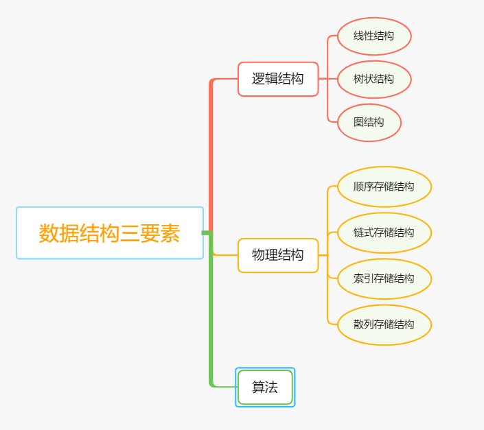

# 数据结构

此项目为自己在学习数据结构的笔记与代码实践. 

学习时参考书目为:

1. [《算法导论(第三版)》](https://book.douban.com/subject/20432061/)
2. [《数据结构 严蔚敏 / 吴伟民》](https://book.douban.com/subject/2024655/)
3. [《挑战程序设计竞赛2 算法和数据结构》](https://book.douban.com/subject/26886659/)

## 目录

- [Ch1 基础知识](Ch1基础知识/README.md)
- 线性结构
  - [Ch2 线性表](Ch2线性表/README.md)
  - [Ch3 栈和队列](Ch3栈和队列/README.md) (操作受限的线性表)
- [Ch4 树](Ch4树/README.md)
- [Ch5 图]
- [Ch6 排序]

## 内容概览

数据结构在各大教材里没有严格的定义, 可以简单的理解为 **数据结构是研究非数值计算的程序设计的问题中计算机的操作对象之间的关系和操作的学科**. 而计算机操作的对象的本质就是数据,  数据结构的研究内容就是数据的逻辑结构, 物理存储结构和算法.

1. 逻辑结构:
   * 定义: 数据的组织形式, 用来表示数据元素之间的逻辑关系, 即数据元素之间的关联方式或相邻关系.
   * 组成元素: **数据元素的集合**和**元素之间的关系.**
   * 三大基本逻辑结构: 
     * 顺序结构: 数据之间存在一对一的前驱和后继关系.
     *  树状结构: 存在唯一个数据元素处于最高层次, 称其为根节点, 其余元素(也叫节点)有且仅有一个前驱, 而后继没有个数的限制.
     *  图结构: 每个数据元素可有任意个前驱和后继, 任何两个节点之间都有可能邻接.
2. 物理结构:
   * 定义: 数据元素及其关系在存储器中的存放形式称之为数据的物理结构.
   * 特点: 一种逻辑结构可以采用任意一种物理存储结构, 但不同的逻辑结构会影响到数据的操作.
   * 分类: 
     * 顺序存储结构: 元素按照某种顺序存储在连续的存储单元里,存储位置的关系反应了元素的逻辑关系
     * 链式存储结构: 元素存储在不一定连续的存储单元里, 通过元素里的附加信息来表示相关的元素的物理地址来建立逻辑关系
     * 索引存储结构:  将元素排成一个序列, 则每个元素在其序列里有一个位置成为该元素的索引, 在存储时建立附加的索引表, 索引表中的索引一一对应原来的序列 
     * 散列存储结构: 每个元素均匀放在存储器中, 通过建立一个数据元素和存储器之间的映射关系(函数为实现形式), 根据这个印象关系可以得到其物理存储地址
3. 算法(数据的运算):
   * 算法是对于数据元素进行的某种操作, 包括但不限于增, 删, 改, 查. 算法和数据结构密不可分.

## Licensing

This project is licensed under [MIT license](LICENSE). 