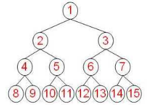

# 10.堆

## 10.1 完全二叉树

所有叶节点深度相同，且所有的内部节点都有两个子节点的二叉树为`完全二叉树`



若二叉树的叶节点深度的最大差距为1，并且最下层叶节点都集中在左边的若干位置上，则也为`（近似）完全二叉树`

若节点数为n， 那么完全二叉树的树高$log_2n$.  


## 10.2 二叉堆

二叉堆是一种特殊的堆，二叉堆是完全二元树（二叉树）或者是近似完全二元树（二叉树）。

二叉堆有两种：

- 最大堆：父结点的键值总是大于或等于任何一个子节点的键值；
- 最小堆：父结点的键值总是小于或等于任何一个子节点的键值。

*只有父子节点之间拥有大小关系, 兄弟节点之间无关联.*

通过这种数据结构的性质, 可以在保持数据大小关系的前提下, 有效的取出(删除)优先级最高的元素或者添加新元素.

二叉堆的逻辑结构虽然是完全二叉树, 但实际上却用一位数组来表示的:

> 二叉堆的数组为A, 大小(元素数)为H, 则二叉堆的元素存储在A[1,...,H]中.
>
> 当给定一个节点的下标i时, 就可以通过$i/2, 2\times i, 2 \times 2 + 1$来获取父节点, 左子节点, 右子节点的下标, 其中$i/2$向下取整,表示小于等于实数x的最大值.

### 10.2.1 数组堆化处理

- 将给定数组进行最大堆处理<code>maxHeapify(A, i)</code>用于从根节点`i`像叶节点方向寻找`A[i]`值的恰当位置,从而使以`i`为根节点的子树成为最大堆.设堆的大小为`H`. 则算法如下:

    ```
    maxHeapify(A, i)
        l = 2*i
        r = 2*i+1
        //从左右子节点, 自身选出最大的节点
        if l < H && a[i] < a[l]
            largest = l
        else
            largest = i
        if r < H && a[largest] < a[r]
            largest = r

        //如果i自身的值小于子节点
        if largest != i
            swap A[i] and A[largest]
            maxHeapify(A, largest)	//递归调用自身

    ```

- 将数组里的非叶节点都进行<code>maxHeapify(A, i)</code>处理

  ```
  buildMaxHeap(A)
  	for i = 2/H downto 0
  		maxHeapify(A, i)
  ```

  

**[代码实现](./heap/maximum.go)**